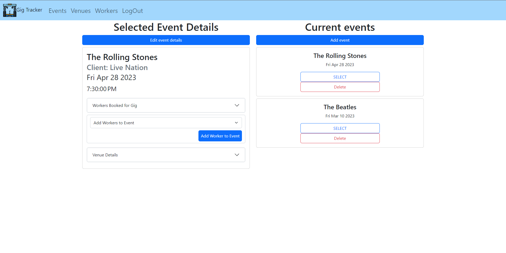

# Project Two - Gig Tracker

## Welcome to Dunn Deal Production's Gig Tracker

- Gig Tracker is e a RESTful CRUD app that a Production Manager in the live event/concert industry can use to manage their events, workers, and venues.  A user will be able to add/remove information about upcoming and past events/gigs, venue information and workforce contacts.

## Screenshots

- Landing Page

- Venues Show Page

- Events Detailed Page

- Add Worker Page

## Technologies Used
- Mongoose
- MongoDB
- Node.js
- Express
- HTML5
- CSS 3
- JavaScript ES6
- OAuth
- Microsoft Paint 

## Getting Started

[Link to Trello board](https://trello.com/invite/b/YOBnTbBd/ATTI8ee0c9a0f0b1b3c5f487251a005989b515614C7C/gig-tracker)

## Next Steps
- Implement the following user stories:
    - AAU I want to see a Google Map of the venue location
    - AAU I want to be able to add to a list of food nearby the venue
    - AAU I want to see a calender view of all events
