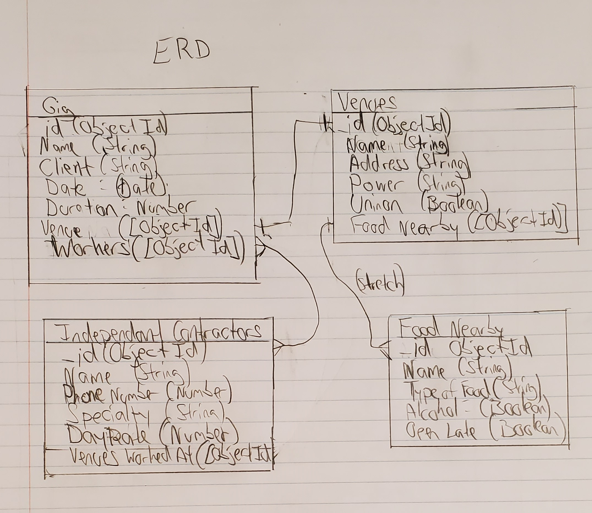
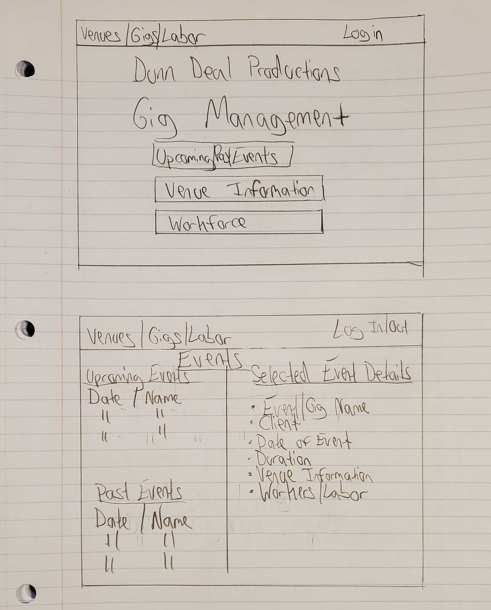
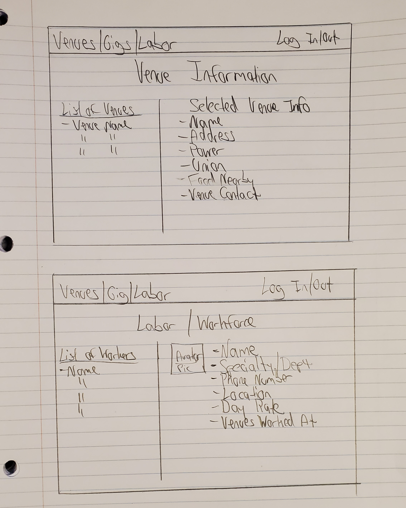

# Project Two - Gig Tracker

## Welcome to Dunn Deal Production's Gig Tracker

The goal of this project is to create a RESTful CRUD app that a Production Manager in the live event/concert industry can use to manage their work.  A user will be able to add/remove information about upcoming and past events/gigs, venue information and workforce contacts.

## ERD Diagram

## Landing Page + Events Page

## Venue + Worker Page

Link to trello board
https://trello.com/invite/b/YOBnTbBd/ATTI8ee0c9a0f0b1b3c5f487251a005989b515614C7C/gig-tracker

## User Stories - See Trello for more details
- AAU I want to be able to select what group of information I want to see and/or edit
- AAU I want to be able to see and add to a list of past and future gigs
- AAU I want to be able to see and add/remove venues
- AAU I want to be able to see and add/remove independent contractors
- AAU when viewing a gig detail page, I want to be able to see information about the venue.
- AAU when viewing list of all venues, I want to have a asterisk for venue in upcoming events

- Stretch Goals
    - AAU I want to be able to add to a list of food nearby the venue
    - As a logged in user I want to have full access to add/delete, venues and gigs, but only see other workers
    - As a logged out user, I want to be able to only see upcoming events. No adding or removing

## Relationships 
   - User(production manager) has many gigs.(1:Many)
   - An event/gig has many workers and a worker can work many gigs.(many:many)
   - An event/gig has one venue. (1:1)
   - A venue has many gigs(Many:1)
   -(stretch)A venue has many food places nearby and a food place has many venues nearby.(many:many)